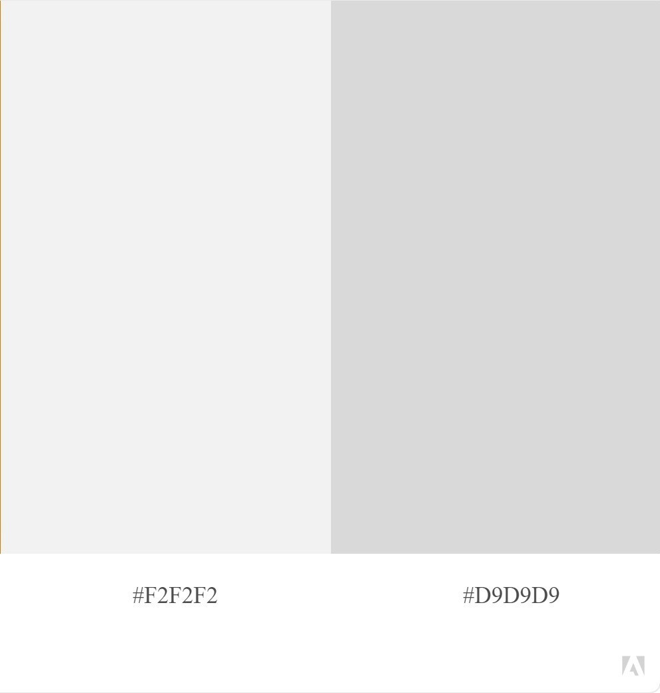
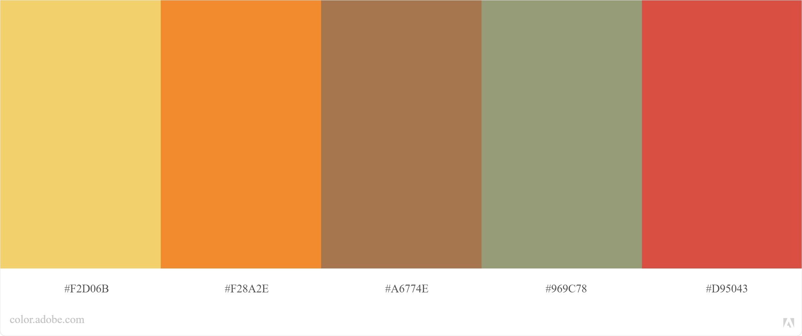

# Event Website
It is a responsive event website project that organize and follow for craftmanship events. This project is a summer pasture project (June - July 2021) given to the learners during their web development training at BeCode. This project is in progress.

In this project the learner intend to use VueJS for frontend, ExpressJS (NodeJS) for Backend and MySQL for the database. 

## Instruction Link
[https://github.com/becodeorg/BXL-Swartz-4-27/tree/master/3.Summer-pasture/npProject](https://github.com/becodeorg/BXL-Swartz-4-27/tree/master/3.Summer-pasture/npProject)

## Language used
- HTML5, CSS3
- VueJS, NodeJS (ExpressJS)
- MySQL

## Graphic Charter
  ### Typography
  - #### Logo, Titles
    [Parisienne](https://fonts.google.com/specimen/Parisienne?query=Parisienne)
  
  - #### Paragraphs, Links, Buttons
    [Open Sans](https://fonts.google.com/specimen/Open+Sans?query=open+sans)
  ### Colors
  - Main Colors
    
  - Secondary Colors
  

  ### Images
  - [www.unsplash.com](https://unsplash.com/)

## Mockups - coming soon

## Database - coming soon

## Project Website - coming soon

## Credits - coming soon

### Site Model
  - [Meetup Website](https://www.meetup.com/home/)
  - [Nordic Website](https://nordic.design/2022/)
  - [CycleByCycle Website](http://www.cyclebycycle.com/)
  - [emg.art Website](http://emgdotart.org/en/detail-ongoing-events/aTujiaVillageOfReLivingTogetherEN.html) 
  - [European an day of Local Solidarity Website](http://2016.europeandaysoflocalsolidarity.com/)
  - [Digital Dosis](https://digitaldosis.com/works)